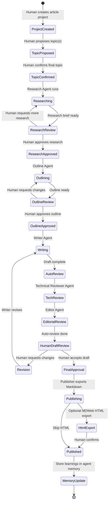

# LightBooksAgent — Project Plan

A local-first, multi-agent platform for publishing technical articles about programming, game development, and game design. Built with **C# Microsoft Agent Framework**, **Blazor Server**, and a **local llama.cpp** LLM at `http://localhost:9931/v1`.

---

## Goals

| Goal | Approach |
|------|----------|
| Learn C# AI agents practically | Microsoft Agent Framework: agents, tools, workflows, checkpoints, HITL |
| Publish technical articles | End-to-end pipeline from human topic proposal → research → writing → review → export |
| Stay local | All LLM inference via llama.cpp; no cloud AI APIs |
| Human control | Mandatory approval gates at topic confirmation, outline, draft, and publish |
| Observability | Blazor UI with live agent status, activity history, start/stop controls |
| Continuous improvement | Agent memory system — agents learn from past articles and feedback |

---

## Publishing Workflow

The pipeline is a **state machine** orchestrated by MAF sequential workflows with **Human-in-the-Loop (HITL)** gates.



### Step-by-step

| # | Step | Actor | Output | HITL? |
|---|------|-------|--------|-------|
| 1 | **Create project** | Human (UI) | Title, category, audience, seed keywords | — |
| 2 | **Propose topic** | Human (UI) | 1–3 topic ideas with angle and target reader | — |
| 3 | **Confirm topic** | Human (UI) | Selected topic locked for pipeline | **Required** |
| 4 | **Research** | Research Agent | Summaries, key quotes, bibliography with URLs, relevance scores | — |
| 5 | **Research review** | Human (UI) | Approve research or request more sources | **Required** |
| 6 | **Outline** | Outline Architect Agent | H2/H3 structure, learning objectives, code-example slots | — |
| 7 | **Outline review** | Human (UI) | Approve or comment on outline | **Required** |
| 8 | **Draft writing** | Writer Agent | Full article in Markdown (category-specific prompt) | — |
| 9 | **Technical review** | Technical Reviewer Agent | Accuracy notes, code fixes, missing concepts | — |
| 10 | **Editorial review** | Editor Agent | Clarity, tone, structure suggestions | — |
| 11 | **Critical human review** | Human (UI) | Accept / request revision with comments | **Required** |
| 12 | **Revision loop** | Writer Agent | Revised draft (max N iterations, configurable) | Optional re-review |
| 13 | **Final approval** | Human (UI) | Approve for publish or archive | **Required** |
| 14 | **Publish** | Publisher | Export `.md` + frontmatter YAML to `articles/` | **Required** |
| 15 | **HTML export** (optional) | MDWeb integration | Static HTML site via [MDWeb](../MDWeb) | Human opts in |
| 16 | **Memory update** | Memory Service | Store article outcomes, feedback, and lessons for future runs | Automatic |

### Key workflow change

**Human proposes topics first**, then agents research the confirmed topic. This keeps you in control of editorial direction while agents handle depth and synthesis.

---

## Agents

| Agent | Role | Key tools |
|-------|------|-----------|
| **Research Agent** | Fetch URLs, summarize sources, build research brief | `FetchUrl`, `SaveResearchNote`, `QueryMemory` |
| **Outline Architect** | Structure article before writing | `ReadResearchBrief`, `GenerateOutline`, `QueryMemory` |
| **Writer Agent** | Produce Markdown draft (Programming / GameDev / GameDesign prompts) | `ReadOutline`, `WriteSection`, `QueryMemory` |
| **Technical Reviewer** | Check accuracy and completeness | `ReadDraft`, `AnnotateIssue`, `QueryMemory` |
| **Editor Agent** | Improve clarity and flow | `ReadDraft`, `ApplyEdits`, `QueryMemory` |
| **Publisher** | Export Markdown; optionally invoke MDWeb for HTML | `ExportMarkdown`, `GenerateHtmlViaMdWeb` |

The **Orchestrator** is a MAF workflow (not a chat agent) that sequences the above with HITL gates.

---

## Agent Memory System

Agents learn from past experience through a layered memory model:

### Memory layers

| Layer | Scope | Contents | Retrieval |
|-------|-------|----------|-----------|
| **Episodic** | Per article run | Research notes, drafts, human feedback, approval/rejection reasons | By `ArticleProjectId` |
| **Semantic** | Cross-article | Distilled lessons: "avoid X pattern", "readers prefer Y structure" | Vector similarity (local embeddings via llama.cpp `/v1/embeddings`) |
| **Procedural** | Per agent role | Successful prompt patterns, tool usage stats, revision strategies | By agent name + category |

### Memory lifecycle

1. **Before agent run** — `IMemoryService.RetrieveContextAsync(agentName, category, topic)` injects relevant memories into the agent system prompt.
2. **During run** — Agents call `SaveObservation` tool for notable findings.
3. **After human review** — Feedback is stored as episodic memory and distilled into semantic memory entries.
4. **After publish** — A **Reflection Agent** (lightweight, post-pipeline) summarizes what worked and what to improve; stored for future runs.

### Storage

- SQLite tables: `AgentMemoryEntry`, `MemoryEmbedding` (blob), `MemoryReflection`
- Embeddings generated locally via llama.cpp — no external vector DB required for MVP

---

## MDWeb Integration (Optional HTML Export)

After Markdown export, the user can optionally generate HTML using [MDWeb](../MDWeb):

- **Default theme** — documentation-style static site
- **WeChat theme** — inline-styled HTML for 微信公众号

Integration via project reference to `MDWeb.Application` and `MDWeb.Infrastructure`, using `ISiteGenerator` programmatically. Configuration in `appsettings.json`:

```json
{
  "MdWeb": {
    "ProjectPath": "../MDWeb",
    "DefaultTheme": "themes/default",
    "WeChatTheme": "themes/wechat"
  }
}
```

---

## Blazor UI Features

| Page | Purpose |
|------|---------|
| **Dashboard** | Active runs, pending HITL count, agent status summary, recent activity |
| **Articles** | List/create article projects |
| **Article Workspace** | Workflow timeline, research materials, draft versions, side-by-side review |
| **Review Queue** | Pending HITL approvals with approve/reject/comment |
| **Agent Monitor** | Per-agent status, current activity, start/stop/pause, URL research table |
| **Activity Feed** | Real-time SignalR stream, filterable by agent/article |
| **Memory Explorer** | Browse agent memories, episodic history, semantic lessons |
| **Settings** | LLM endpoint, MDWeb paths, revision limits, URL allowlist |

---

## Constraints

- **LLM**: Strictly local at `http://localhost:9931/v1` (OpenAI-compatible API)
- **Research URLs**: HTTP fetch allowed; optional domain allowlist
- **No cloud AI**: No Azure OpenAI, OpenAI, Anthropic, or similar remote model APIs
- **Storage**: SQLite for metadata; file system for Markdown/HTML artifacts

---

## Article Categories

- Programming
- Game Development
- Game Design

Each category has a dedicated Writer Agent prompt template and memory partition.
