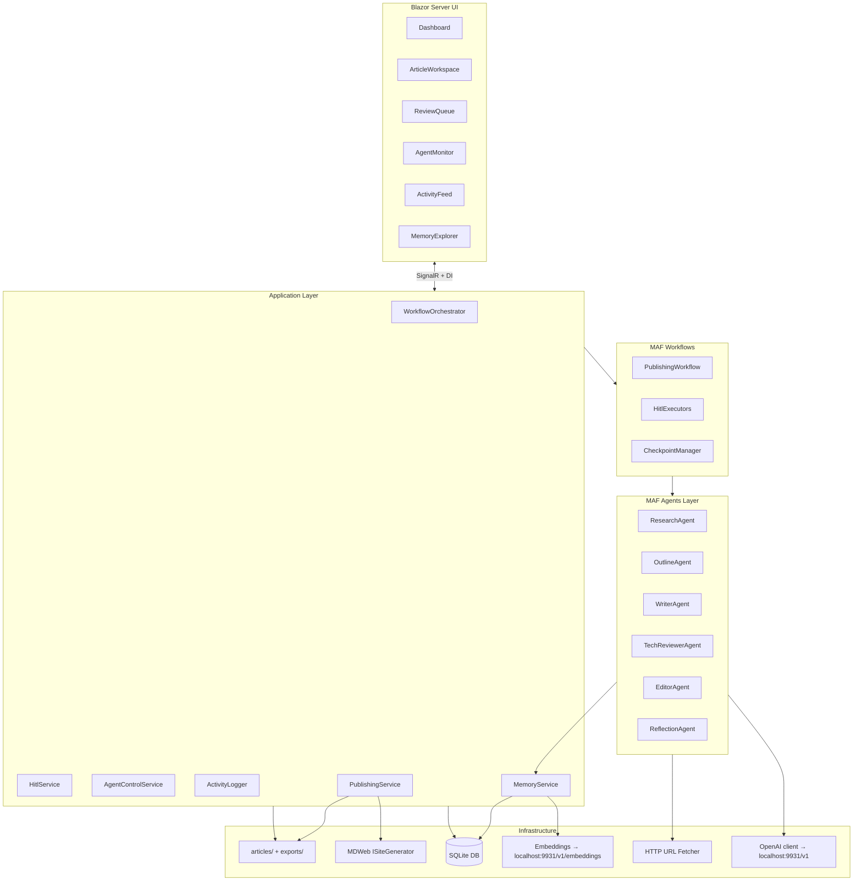
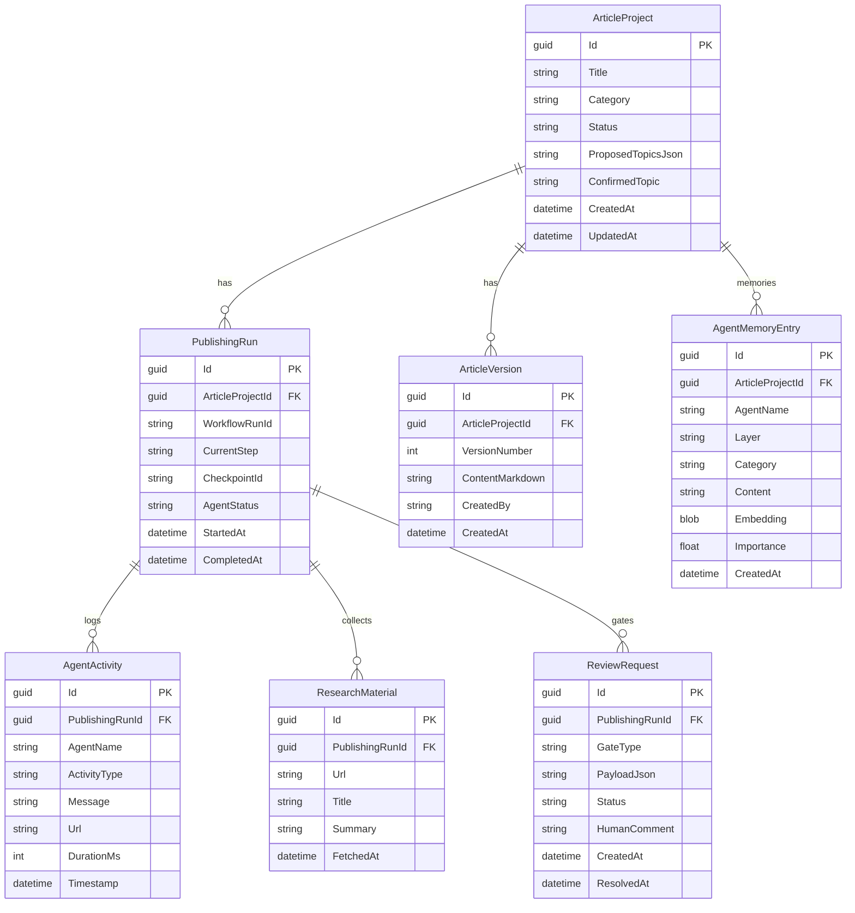
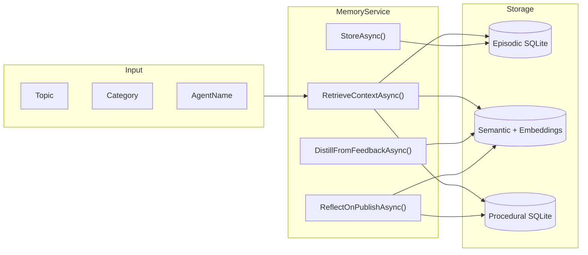
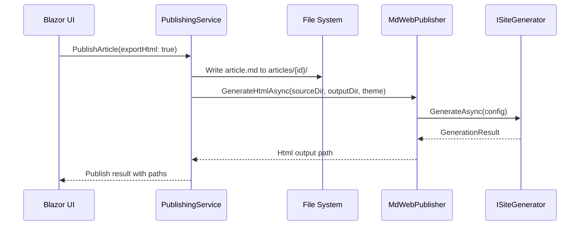

# LightBooksAgent — System Design

## 1. Architecture Overview



---

## 2. Solution Structure

```
LightBooksAgent/
├── docs/
│   ├── plan.md
│   ├── system-design.md
│   └── roadmap.md
├── src/
│   ├── LightBooksAgent.Web/           # Blazor Server host, SignalR hubs, pages
│   ├── LightBooksAgent.Core/          # Domain entities, enums, interfaces
│   ├── LightBooksAgent.Application/   # Services, orchestration, HITL, memory
│   ├── LightBooksAgent.Agents/        # MAF agent definitions, prompts, tools
│   ├── LightBooksAgent.Workflows/     # MAF workflow graphs, HITL executors
│   └── LightBooksAgent.Infrastructure/ # EF Core, SQLite, LLM, MDWeb, URL fetch
├── tests/
│   └── LightBooksAgent.Core.Tests/
├── articles/                          # Published Markdown (gitignored content)
├── exports/                           # HTML exports (gitignored)
└── data/                              # SQLite database (gitignored)
```

---

## 3. Layer Responsibilities

### 3.1 LightBooksAgent.Core

Pure domain — no external dependencies.

- **Entities**: `ArticleProject`, `PublishingRun`, `AgentActivity`, `ResearchMaterial`, `ArticleVersion`, `ReviewRequest`, `AgentMemoryEntry`
- **Enums**: `ArticleCategory`, `PublishingStep`, `AgentStatus`, `ReviewGateType`, `MemoryLayer`
- **Interfaces**: `IMemoryService`, `IActivityLogger`, `IHitlService`, `ILocalLlmClient`, `IMdWebPublisher`, `IPublishingWorkflowRunner`

### 3.2 LightBooksAgent.Application

Business logic and orchestration.

- `PublishingWorkflowService` — start/pause/stop/resume runs
- `HitlService` — create review requests, process human responses, resume MAF workflow
- `AgentControlService` — cancellation tokens, agent status tracking
- `ActivityService` — persist and broadcast agent activities
- `MemoryService` — store/retrieve/distill agent memories
- `ArticleService` — CRUD for article projects and versions

### 3.3 LightBooksAgent.Agents

MAF agent factory and tool definitions.

- `AgentFactory` — creates configured `AIAgent` instances with local LLM
- Per-agent system prompts (in `Prompts/`)
- Tools: `FetchUrlTool`, `SaveResearchNoteTool`, `QueryMemoryTool`, `SaveObservationTool`
- `AgentActivityMiddleware` — logs every invocation to `IActivityLogger`

### 3.4 LightBooksAgent.Workflows

MAF workflow definitions.

```
TopicConfirmed → Research → [HITL: ResearchApproval]
  → Outline → [HITL: OutlineApproval]
  → Write → TechReview → Edit
  → [HITL: DraftReview] → (optional Revision loop)
  → [HITL: FinalApproval]
  → Publish → (optional MDWeb HTML)
  → MemoryUpdate
```

- Uses MAF **sequential orchestration** with custom **RequestPort** executors at HITL gates
- **CheckpointManager** backed by SQLite for pause/resume across app restarts

### 3.5 LightBooksAgent.Infrastructure

External integrations.

| Component | Implementation |
|-----------|----------------|
| LLM chat | `OpenAIClient` with `Endpoint = http://localhost:9931/v1` |
| Embeddings | `POST /v1/embeddings` on same endpoint |
| Database | EF Core + SQLite (`data/lightbooks.db`) |
| URL fetch | `HttpClient` with timeout and optional allowlist |
| MDWeb | Project refs to `MDWeb.Application` + `MDWeb.Infrastructure`; `MdWebPublisher` wraps `ISiteGenerator` |
| Checkpoints | `SqliteCheckpointManager` implementing MAF checkpoint persistence |

### 3.6 LightBooksAgent.Web

Blazor Server application.

- **SignalR hubs**: `ActivityHub`, `WorkflowHub`
- **Pages**: Dashboard, Articles, Article detail, Review queue, Agent monitor, Memory explorer, Settings
- **Components**: `WorkflowStepper`, `ActivityFeed`, `AgentStatusCard`, `ReviewPanel`, `ResearchUrlList`

---

## 4. Data Model



---

## 5. MAF Workflow + HITL Design

### HITL gate types

| Gate | Trigger | Human action |
|------|---------|--------------|
| `TopicConfirmation` | After human proposes topics | Select/confirm one topic |
| `ResearchApproval` | Research Agent completes | Approve brief or request more research |
| `OutlineApproval` | Outline Agent completes | Approve or comment |
| `DraftReview` | Auto-review completes | Accept or request revision |
| `FinalApproval` | Draft accepted | Approve for publish |
| `PublishConfirmation` | Markdown exported | Confirm publish (+ optional HTML) |

### Checkpoint + resume

1. MAF `CheckpointManager` saves state after each workflow step.
2. Pending HITL `RequestInfoEvent` objects are persisted in `ReviewRequest`.
3. On app restart, workflow resumes from checkpoint; pending requests are re-emitted.
4. Human submits response via UI → `HitlService.RespondAsync()` → workflow continues.

### Agent control

- Each `PublishingRun` has a `CancellationTokenSource`
- **Stop** — cancel token, save checkpoint at current step
- **Pause** — cancel token without completing step; resume from checkpoint
- **Start** — create new run or resume from checkpoint

---

## 6. Agent Memory Design



### Memory injection

Before each agent invocation, `MemoryService` builds a context block:

```
## Relevant past experience
- [Programming/Writer] Readers responded well to step-by-step code examples with expected output.
- [GameDev/Research] Official Unity docs are more reliable than forum posts for API details.
- [Editor] Previous article on ECS was rejected for lacking a comparison table — include one.
```

### Post-publish reflection

The **Reflection Agent** runs once after publish:

- Input: final draft, all human feedback, research materials used
- Output: 3–5 distilled lessons stored as semantic memory with embeddings

---

## 7. MDWeb Integration



### Configuration options

| Option | Default | Description |
|--------|---------|-------------|
| `MdWeb.ProjectPath` | `../MDWeb` | MDWeb repo root |
| `MdWeb.DefaultTheme` | `themes/default` | Documentation site theme |
| `MdWeb.WeChatTheme` | `themes/wechat` | WeChat article theme |
| `MdWeb.OutputBasePath` | `./exports` | HTML output directory |

---

## 8. Real-time Observability

### SignalR events

| Event | Payload |
|-------|---------|
| `ActivityLogged` | `AgentActivity` |
| `AgentStatusChanged` | agent name, status, current task |
| `WorkflowStepChanged` | run id, new step |
| `ReviewRequested` | `ReviewRequest` |
| `RunCompleted` | run id, success/failure |

### Activity types logged

- `AgentStarted`, `AgentCompleted`, `AgentError`
- `ToolInvoked` (with tool name and args summary)
- `UrlFetched` (with URL and status code)
- `LlmCall` (token count, duration — no prompt content in feed by default)
- `MemoryRetrieved`, `MemoryStored`
- `HitlGateReached`, `HitlResolved`

---

## 9. Configuration

```json
{
  "LocalLlm": {
    "BaseUrl": "http://localhost:9931/v1",
    "Model": "local-model",
    "EmbeddingModel": "local-model",
    "MaxTokens": 4096,
    "Temperature": 0.7
  },
  "MdWeb": {
    "ProjectPath": "../MDWeb",
    "DefaultTheme": "themes/default",
    "WeChatTheme": "themes/wechat",
    "OutputBasePath": "./exports"
  },
  "Publishing": {
    "MaxRevisionLoops": 3,
    "ArticlesPath": "./articles",
    "UrlFetchTimeoutSeconds": 30,
    "UrlAllowlist": []
  },
  "Database": {
    "ConnectionString": "Data Source=./data/lightbooks.db"
  }
}
```

---

## 10. Security Notes

- Local-only application; no authentication required for MVP
- URL fetch respects optional domain allowlist
- LLM prompts may contain article content — keep database local
- No secrets in repository; `appsettings.Development.json` for local overrides
